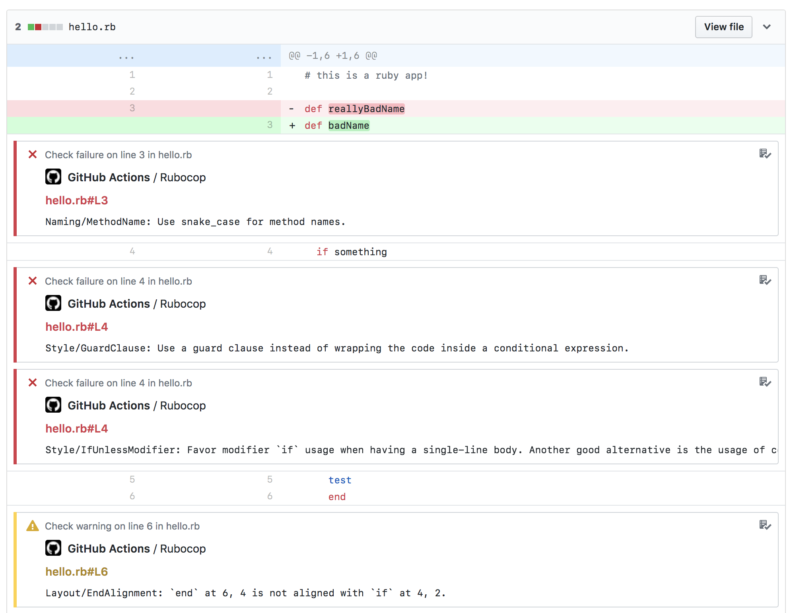

# Github Action: Rubocop

- [Github Action: Rubocop](#github-action-rubocop)
  - [How it works](#how-it-works)
  - [Supported Ruby versions](#supported-ruby-versions)
  - [Configuration](#configuration)
  - [Instructions](#instructions)

Lint your Ruby code in parallel to your builds.


## How it works
- A Dockerfile with the following gems runs a `rubocop` check on your codebase using:
  - rubocop -v 1.63.4
  - rubocop-rspec -v 2.29.2
  - rubocop-performance -v 1.21.0
  - rubocop-rails -v 2.24.1
- Errors are then reported per-line on the PR's checks tab.


Versions are fixed to avoid breaking changes on the gems. If you want to update the versions, you can do so by changing the Dockerfile in the repository and *opening a PR* to update the action.

## Configuration
In order to run all the checks, you need to have a `.rubocop.yml` file in your repository. You can generate one by running `rubocop --auto-gen-config` on your project's root. This is optional, but it is recommended to have one to customize the checks to your project's needs.

In case no configuration is found, the action will use the default configuration file provided by the gems. For more information, check the [rubocop documentation](https://docs.rubocop.org/rubocop/configuration.html).

You can also customize the rubocop extensions that will run by adding the following to your `.rubocop.yml` file:

```yaml
require:
  - rubocop-rspec
  - rubocop-performance
  - rubocop-rails
```


## Supported Ruby versions
- Ruby 3+ (older versions are supported on *<=1.5.6 versions of this action*)





## Instructions

In order to use this action you will need to specify the `$GITHUB_TOKEN` alongside the check:


```yaml
# Worflow example
name: CI
on: [push]

jobs:
  build:
    runs-on: ubuntu-latest
    steps:

    - uses: actions/checkout@v1

    - name: Rubocop checks
        uses: luizfonseca/github-actions-rubocop@2.0.0
        env:
          GITHUB_TOKEN: ${{ secrets.GITHUB_TOKEN }}
```
